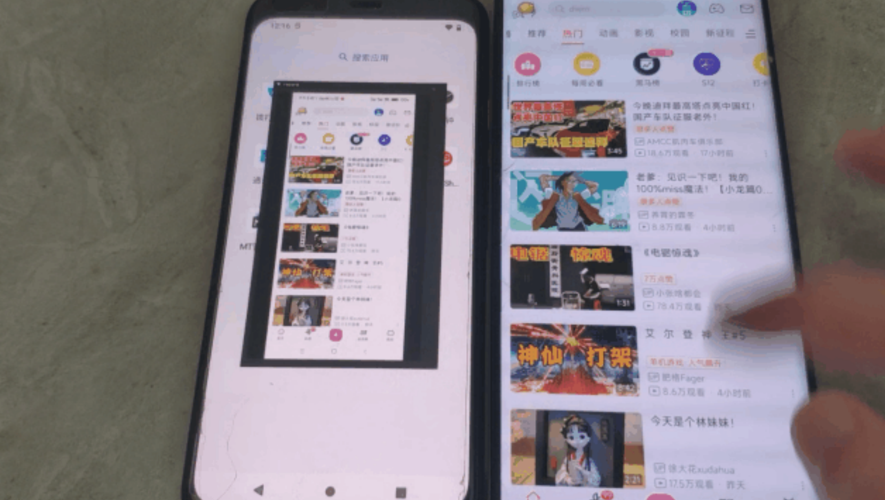
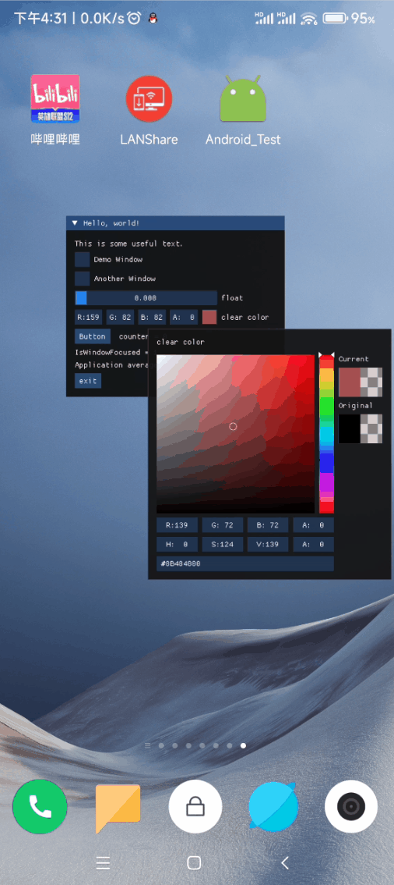

## Android_Native_Surface

## 关于

[此项目基于 Android_Native_Surface](https://github.com/SsageParuders/Android_Native_Surface)

### 功能

- Android c++ 绘制和录屏，目前只测试了安卓12和12.1，触摸穿透只在安卓13/14设备测试正常，安卓14卡触摸已修复在x86_64设备上测试无问题，其他版本需要自行测试

### libs

- 项目支持到 Android 9 ~ 14
### 目录
- [libsurface](libsurface) c++ 绘制库
- [examples](examples) 绘制库使用示例
- [screenRecord](screenRecord) 录屏代码示例
- [outputs](outputs) 编译后文件输出路径
- [outputs/include](outputs/include)  c++ 绘制库头文件，供外部调用使用

---

### 效果图

- 录屏
  <br> <br>
  
- 绘制
  <br> <br>
  

---

### aosp_res/ android level /aosp_native_surface

- 编译
    - 下载aosp项目，复制对应aosp_res下的安卓版本到aosp根目录的 external/aosp_native_surface
    - cd到external/aosp_native_surface执行mm命令编译
    - 编译完成后输出路径在out/target/product/system/(lib,lib64)/libSsage.so

---

### 执行方法演示

>   ```bash
>     chmod +x nativeSurface
>     ./nativeSurface
>   ```

